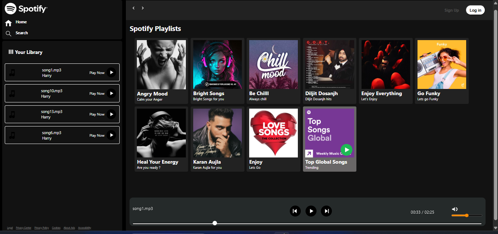
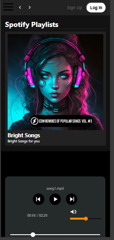
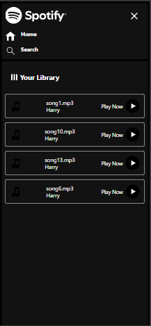

## 📁 Folder Structure

```
project-root/
├── index.html
├── style.css
├── utility.css
├── script.js
├── pic/
│   ├── play.svg
│   ├── pause.svg
│   ├── next.svg
│   ├── previous.svg
│   ├── logo.svg
│   ├── volume.svg
│   ├── mute.svg
│   ├── search.svg
│   └── ...other icons
├── songs/
│   ├── chill/
│   │   ├── song1.mp3
│   │   ├── cover.jpg
│   │   └── info.json
│   ├── angry/
│   │   ├── song2.mp3
│   │   ├── cover.jpg
│   │   └── info.json
│   └── ...more folders
└── screenshots/
    ├── desktop.png
    ├── mobile1.png
    └── hemberger.png
```

## 📸 Screenshots

### 🖥️ Desktop View


### 📱 Mobile View


### 🍔 Hamburger Menu



---

## 🚀 Features

- 🎵 Dynamic Music Player (Play/Pause, Next/Previous)
- 📂 Folder-based album and song loading
- 🔊 Volume Control and Mute Toggle
- 🖱️ Interactive UI with seekbar and time tracking
- 🎨 Smooth transitions & hover effects
- 📱 Fully Responsive Layout

---

## 🛠 Tech Stack

- HTML5
- CSS3
- JavaScript (Vanilla)
